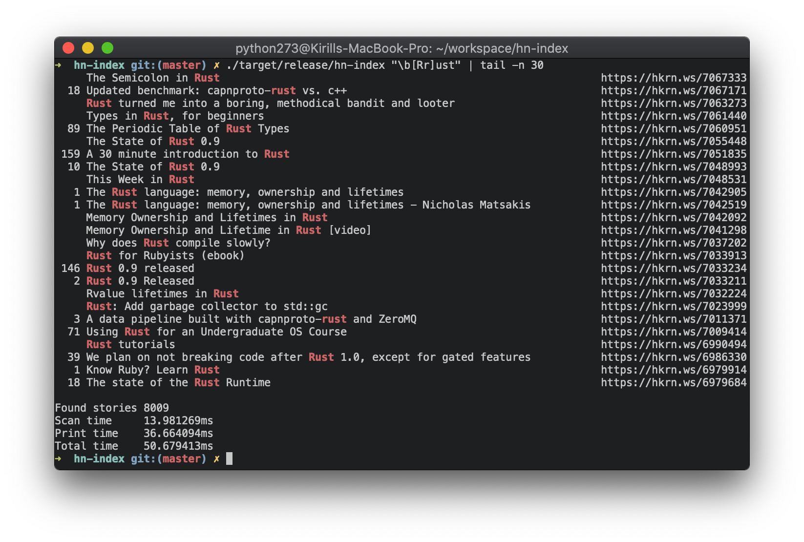

# hn-index

Search Hacker News stories' titles with [regex](https://docs.rs/regex/1.7.1/regex/index.html#syntax).

```
$ wget https://python273.pw/hackernews-stories-dump-1_36270743.tar.gz
$ tar xf hackernews-stories-dump-1_36270743.tar.gz
$ cargo build --release
$ ./target/release/hn-index "\b[Rr]ust"
[...]
 101 Rust Language Cheat Sheet                                                        https://hkrn.ws/26930908
  45 Show HN: High-speed UTF-8 validation in Rust                                     https://hkrn.ws/26887438
[...]

Found stories 11089
Scan time     24.53346ms
Print time    30.233548ms
Total time    54.782431ms
```

`hn-index (regex) [min comments]`



## Dump

Header: `[checkpoint; u32 little endian]*31` (offsets to start scanning by CPU threads)

Format: `[title len; u8][comments num; u16 little endian][title; utf-8][id; u32 little endian]`
