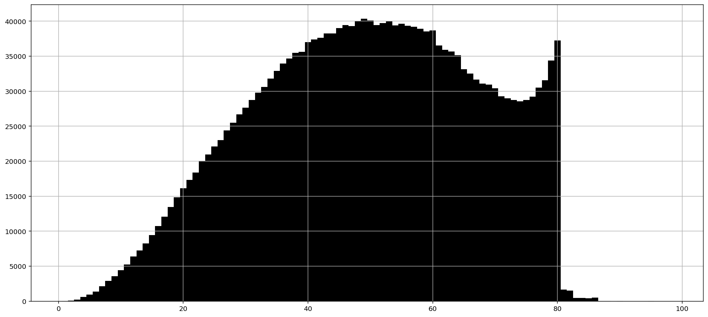
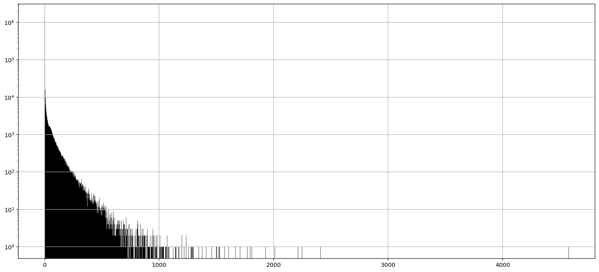
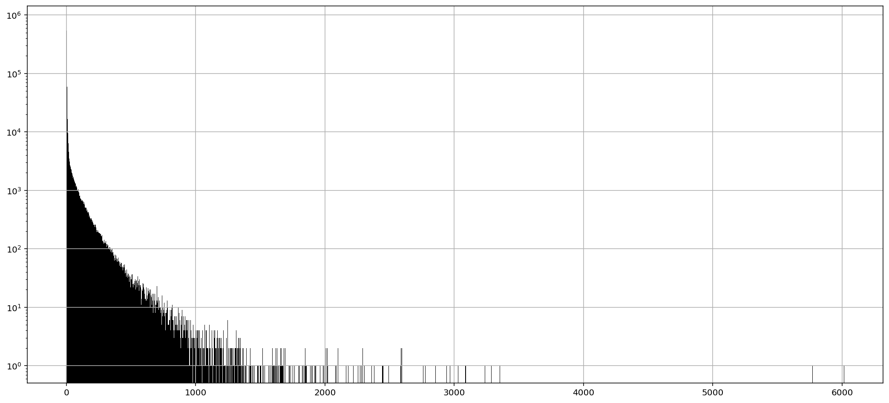

# hn-index

```
$ wget https://python273.keybase.pub/hackernews-stories-dump-994369_27026295.tar.gz
$ tar xf hackernews-stories-dump-994369_27026295.tar.gz
$ cargo +nightly build --release
$ ./target/release/hn-index "(?i)^(rust|.*?\srust)" 2
[...]
 101 Rust Language Cheat Sheet                                                        https://hkrn.ws/26930908
  45 Show HN: High-speed UTF-8 validation in Rust                                     https://hkrn.ws/26887438
[...]

Found stories 1854
Scan time     22.132114ms
Print time    5.135162ms
Total time    27.313745ms
```

## Dump

Source: https://hn.algolia.com/api

Format: `[id - u32;hex 8 chars][comments num - u16;hex 4 chars][title]\n`

## Bonus memes




